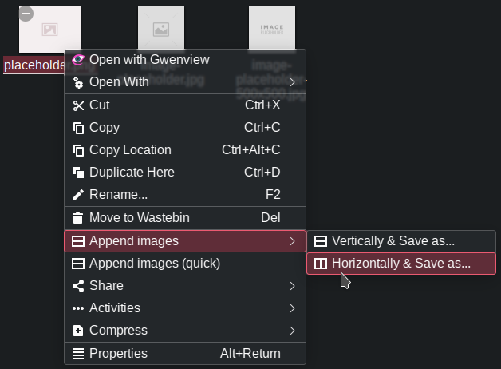

# dolphin-append-images-menu

Dolphin service menu options for quickly appending images using ImageMagick.



## Requirements & installation

Both menus require ImageMagick's `convert` utility to be present somewhere in `$PATH`. Menu with "Save as..." functionality also requires `kdialog`.

```
git clone https://github.com/jwty/dolphin-append-images-menu
cd dolphin-append-images-menu
mkdir -p ~/.local/share/kservices5/ServiceMenus/

cp *.desktop ~/.local/share/kservices5/ServiceMenus/

# Or just install one of the menus, they are independend of each other:
cp appendImagesQuick.desktop ~/.local/share/kservices5/ServiceMenus/
```

Or install from KDE Store (available directly in Dolphin in `Settings -> Configure Dolphin... -> Context Menu -> Download New Services...`):
- [Append images - quick](https://store.kde.org/p/1686267)
- [Append images - save as](https://store.kde.org/p/1686268)

## Usage

### appendImagesQuick.desktop

This menu option will try to append selected images vertically (top to bottom) and save resulting image in working directory with filename `appended-$UNIXTIME.jpg`, where `$UNIXTIME` is replaced with current Unix time. Unix time is used to avoid overwrites when appending multiple times in same working directory in a simple way. If, for some reason, it is impossible to save resulting image in current working directory save to `/tmp` will be attempted, with filename created in same way.

### appendImagesMenu.desktop

Submenu with options for appending images vertically (top to bottom) or horizontally (left to right). After selecting orientation a file save dialog will be opened and a path and file name to save resulting image can be selected.

## Contributions

* Dutch translation provided by [Vistaus](https://github.com/Vistaus)
